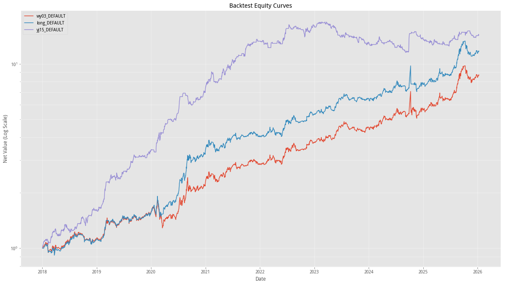
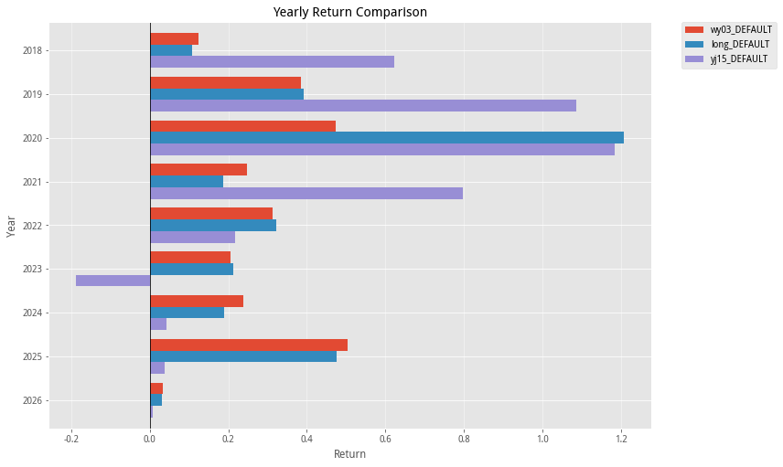
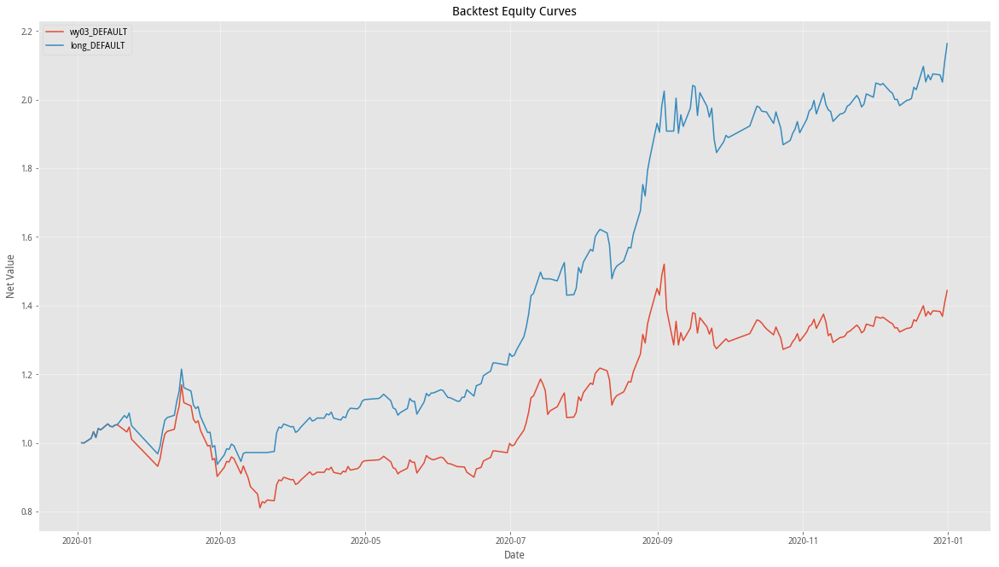
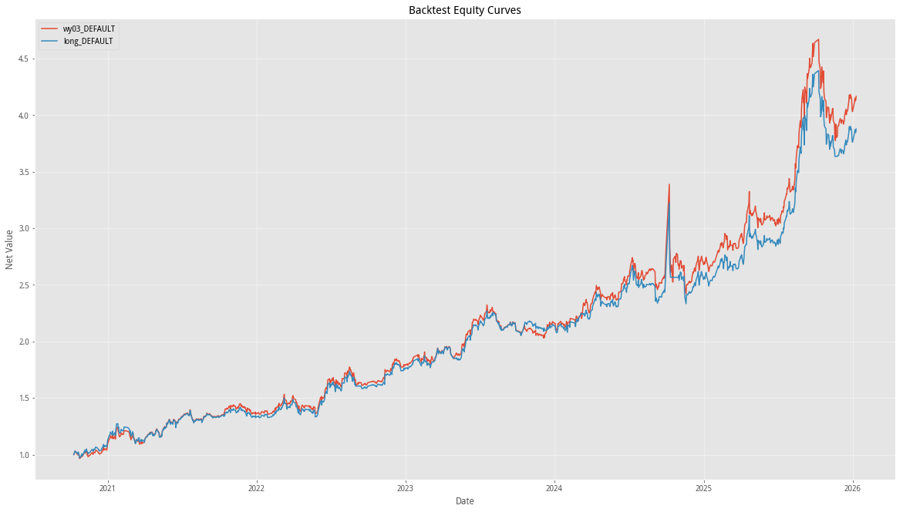

# ETF轮动策略研究(一)：策略逻辑对比与交易时间敏感性

本文旨在对比分析论坛上流行的几种ETF轮动策略。自2023年wy发布“核心资产轮动”以来，社区陆续涌现出大量基于动量、反转及多因子择时的改进版本。

本研究选取了三种具有代表性的ETF轮动策略，深入对比了它们的逻辑差异、实际绩效以及对交易时间的敏感性。

**涉及策略：**
1.  `wy03`：[原版](https://www.joinquant.com/post/42673)，2023年6月发布
2.  `long`：[长短期动量结合版](https://www.joinquant.com/view/community/detail/44046)，2023年9月发布
3.  `yj15`：[综合择时版](https://www.joinquant.com/view/community/detail/41718)，2023年4月发布

选取发布时间较早的策略，旨在利用充足的样本外数据来检验其在真实市场中的有效性，从而更客观地评估其生命力。

为了确保回测的可比性，我对策略代码进行了标准化处理：

1. 统一费用，场内基金滑点固定0.001，交易费用万2免5
2. 为了测试，对原策略做了一些优化，提高测试速度
3. ETF池：依然使用原策略的默认配置，`wy03`和`long`是经典的4只（黄金、纳指、创业板、上证180）；`yj15`是国内的四只（沪深300、上证50、创业板500、中证消费）

## 一、策略逻辑概述

1. 原版 (wy03)
    *   定位：基准策略，纯粹的满仓轮动，同时也作为其他策略的修改基准。
    *   核心逻辑：基于收盘价对数的线性回归斜率打分，选取得分最高的一只 ETF。
    *   交易与风控：每日 09:30 调仓，无择时与风控。
2. 长短期动量结合版 (long)
    *   定位：改进版，引入反转因子与差异化风控。
    *   核心逻辑：“短期动量 - 长期反转”。结合 25 日动量（追涨）与 200 日反转（防高位接盘）。
    *   交易与风控：
        *   极值过滤：市场极度分化（过热，分差>15）或无主线（过冷，分差<0.1）时空仓。
        *   ETF RSRS 过滤：即便排名第一，若处于顶部风险区则剔除不买。
3. 综合择时版 (yj15)
    *   定位：完整交易系统，引入大盘择时总开关与盘中风控。
    *   核心逻辑：乖离率动量。基于90日乖离率的斜率打分，并引入持仓加分（降低换手）与涨跌幅修正。
    *   交易与风控：
        *   大盘择时 (总开关)：基于沪深300 RSRS 决定整体仓位（满仓/空仓）。
        *   盘中风控：11:25/11:27 两次检查，若跌破阈值（60分钟线跌破MA20）提前止损。
    *   交易执行：09:30 卖出，09:35 买入（分离买卖）。

## 二、回测绩效综合评估

### 2.1 核心绩效指标

| 指标 (Metric) | 原版 (wy03) | 长短结合版 (long) | 综合择时版 (yj15) |
| :--- | :--- | :--- | :--- |
| **总收益 (Return)** | 771.91% | 1074.89% | **1335.26%** |
| **年化收益 (Ann. Return)** | 32.06% | 37.21% | **40.78%** |
| **波动率 (Volatility)** | 25.31% | 24.07% | **20.03%** |
| **最大回撤 (Max Drawdown)** | 30.66% | **27.62%** | 31.65% |
| **夏普比率 (Sharpe)** | 1.11 | 1.38 | **1.84** |
| **索提诺比率 (Sortino)** | 1.48 | 1.87 | **3.33** |
| **胜率 (Win Rate)** | 56.48% | 55.81% | 50.92% |
| **平均持仓天数** | 486.75 | 463.75 | **272.00** |

### 2.2 年度收益

| 年份 (Year) | wy03 (原版) | long (长短结合) | yj15 (综合择时) | 胜出策略 |
| :--- | :--- | :--- | :--- | :--- |
| **2018** | 12.43% | 10.89% | **62.17%** | `yj15` (大熊市逆势大赚) |
| **2019** | 38.41% | 39.25% | **108.67%** | `yj15` (牛市弹性最强) |
| **2020** | 47.29% | **120.72%** | 118.42% | `long`/`yj15` (并驾齐驱) |
| **2021** | 24.75% | 18.73% | **79.70%** | `yj15` (结构性行情王者) |
| **2022** | 31.29% | **32.12%** | 21.66% | `wy03`/`long` (稳健防御) |
| **2023** | 20.69% | **21.36%** | -18.75% | `wy03`/`long` (yj15显著失效) |
| **2024** | **23.73%** | 18.93% | 4.38% | `wy03` (回归简单) |
| **2025** | **50.47%** | 47.63% | 3.83% | `wy03`/`long` (动量效应回归) |
| **2026** | **3.37%** | 3.13% | 0.86% | - |

我们发现，`long` 策略在2020年表现极为突出，而其他年份表现与 `wy03` 策略表现基本一致。

**差异分析**

1.  2020年(分水岭): `long` 策略取得 **120.72%** 的惊人收益，远超 `wy03` (47.29%)。核心在于其风控单元，在3月流动性危机中规避了系统性风险，而6月及9月回调中两次精准触发空仓则有参数过拟合的嫌疑。
2.  2021-2026年(趋同): 随着市场未再出现极端风险，`long` 的风控气囊未弹出，策略逻辑退化为"带摩擦成本的 wy03"，导致两者收益曲线高度重合，额外的风控判断反而可能导致轻微踏空。
3.  结论: `long` 本质是 `wy03` 的"带气囊版本"，价值在于应对黑天鹅。

### 2.3 绩效综合评价

从上述涵盖2018-2026年的长期回测数据来看，三种策略均展现了可圈可点的历史战绩。

其中，`yj15` 策略的表现值得重点关注。在整个回测周期中，该策略展现了最强的爆发力，不仅总收益最高，且资金曲线最为平滑，波动率最低，特别是在2018年的熊市中实现了惊人的逆势盈利。然而，观察其样本外表现，该策略出现了显著的**不及预期**现象。其“发布即巅峰”，随即在2023年下半年至2025年遭遇滑铁卢，最大回撤便发生在此期间，且至今未创新高。2023年全年亏损 18.75%，即便在2024-2025年的大牛市中，也仅取得个位数正收益。这强烈暗示了该策略可能过度拟合了2019-2021年的市场特征，参数泛化能力较差；此外，其显著高于其他策略的换手率也可能是导致样本外失效的重要原因。

### 2.4 附录：月度收益明细

| Date | wy03 | long | yj15 | Date | wy03 | long | yj15 |
| :--- | :--- | :--- | :--- | :--- | :--- | :--- | :--- |
| **2018-01** | 5.32% | 3.25% | 10.89% | **2022-01** | -0.73% | -0.73% | -4.03% |
| **2018-02** | -7.27% | -7.76% | 1.82% | **2022-02** | 5.36% | 5.37% | -3.89% |
| **2018-03** | 6.24% | 6.09% | 12.89% | **2022-03** | 5.68% | 5.68% | 5.54% |
| **2018-04** | -4.04% | -4.32% | -8.34% | **2022-04** | -5.08% | -5.08% | 3.13% |
| **2018-05** | 4.59% | 5.74% | 14.66% | **2022-05** | -1.19% | -1.19% | -3.72% |
| **2018-06** | 4.21% | 4.21% | -5.06% | **2022-06** | 16.96% | 16.97% | 21.24% |
| **2018-07** | 5.51% | 5.51% | -1.40% | **2022-07** | 0.94% | 0.94% | -0.82% |
| **2018-08** | 6.04% | 5.50% | 8.30% | **2022-08** | -1.46% | -1.82% | 3.52% |
| **2018-09** | -2.57% | -0.15% | 9.05% | **2022-09** | -0.80% | -0.08% | -3.38% |
| **2018-10** | -6.16% | -6.85% | -5.07% | **2022-10** | 0.63% | 0.63% | -7.96% |
| **2018-11** | -3.28% | -3.29% | 10.28% | **2022-11** | 9.05% | 9.11% | 4.34% |
| **2018-12** | 4.73% | 3.96% | 4.60% | **2022-12** | -0.01% | 0.20% | 8.97% |
| **2019-01** | 0.59% | 0.20% | 2.27% | **2023-01** | 3.76% | 3.56% | 2.23% |
| **2019-02** | 11.80% | 15.27% | 25.79% | **2023-02** | -1.56% | -1.56% | 1.18% |
| **2019-03** | 6.81% | 6.51% | 10.56% | **2023-03** | 4.82% | 6.51% | -1.20% |
| **2019-04** | 2.41% | 2.41% | 7.37% | **2023-04** | -3.82% | -3.26% | -3.56% |
| **2019-05** | -2.41% | -2.41% | -3.39% | **2023-05** | 11.42% | 8.57% | -6.89% |
| **2019-06** | 8.03% | 8.01% | 7.04% | **2023-06** | 6.69% | 6.69% | -4.06% |
| **2019-07** | -0.28% | -0.28% | 4.67% | **2023-07** | 4.46% | 4.46% | 3.94% |
| **2019-08** | -0.36% | -0.36% | 8.45% | **2023-08** | -7.35% | -5.40% | -4.76% |
| **2019-09** | -1.67% | -2.09% | 7.26% | **2023-09** | -1.29% | -1.29% | -1.20% |
| **2019-10** | 2.65% | 1.27% | 0.56% | **2023-10** | 0.96% | 4.11% | 0.05% |
| **2019-11** | 4.91% | 4.92% | -1.33% | **2023-11** | -2.84% | -2.84% | -3.35% |
| **2019-12** | 1.45% | 1.45% | 9.37% | **2023-12** | 5.20% | 1.09% | -2.43% |
| **2020-01** | 3.09% | 7.11% | -1.82% | **2024-01** | -1.63% | -1.92% | -2.91% |
| **2020-02** | -10.75% | -10.75% | 15.68% | **2024-02** | 3.88% | 5.09% | 2.97% |
| **2020-03** | -0.98% | 11.77% | 19.39% | **2024-03** | 5.06% | 2.58% | -0.51% |
| **2020-04** | 6.11% | 7.51% | 8.73% | **2024-04** | 3.12% | 3.12% | -0.09% |
| **2020-05** | 0.30% | 1.72% | -2.56% | **2024-05** | -1.33% | -1.33% | 0.55% |
| **2020-06** | 5.04% | 10.06% | 11.49% | **2024-06** | 9.02% | 9.02% | -6.33% |
| **2020-07** | 14.80% | 21.10% | 25.76% | **2024-07** | 0.61% | 0.61% | 3.43% |
| **2020-08** | 26.51% | 26.50% | -1.82% | **2024-08** | 1.58% | -0.85% | -6.63% |
| **2020-09** | -10.67% | -2.14% | -10.94% | **2024-09** | 7.19% | 7.19% | 23.09% |
| **2020-10** | 0.07% | 0.73% | 7.50% | **2024-10** | -4.93% | -3.75% | 0.91% |
| **2020-11** | 3.35% | 5.45% | 1.89% | **2024-11** | -6.18% | -6.11% | -4.26% |
| **2020-12** | 7.79% | 7.79% | 13.24% | **2024-12** | 6.33% | 4.93% | -2.90% |
| **2021-01** | 5.69% | 5.69% | 8.44% | **2025-01** | 0.82% | 0.82% | -3.17% |
| **2021-02** | -2.38% | -2.38% | -0.21% | **2025-02** | 3.99% | 2.36% | -3.30% |
| **2021-03** | -2.05% | -4.42% | 1.62% | **2025-03** | 4.02% | 4.02% | 1.76% |
| **2021-04** | 10.90% | 10.20% | 15.87% | **2025-04** | 6.55% | 6.54% | -1.78% |
| **2021-05** | 6.89% | 6.89% | 5.13% | **2025-05** | -1.31% | -1.31% | -1.07% |
| **2021-06** | 1.95% | 1.95% | 6.75% | **2025-06** | 0.21% | 0.75% | 5.11% |
| **2021-07** | -3.93% | -3.93% | 3.58% | **2025-07** | 7.88% | 7.88% | 2.81% |
| **2021-08** | 6.35% | 6.35% | 1.42% | **2025-08** | 24.52% | 24.52% | 6.16% |
| **2021-09** | -2.42% | -2.42% | 10.14% | **2025-09** | 12.29% | 12.29% | 1.76% |
| **2021-10** | 7.62% | 5.48% | 5.01% | **2025-10** | -12.26% | -12.26% | 1.95% |
| **2021-11** | -0.67% | -0.83% | 2.15% | **2025-11** | -3.56% | -4.38% | -5.11% |
| **2021-12** | -4.15% | -3.86% | 1.26% | **2025-12** | 2.58% | 2.58% | -0.69% |

## 三、交易时间敏感性深度研究

我们将交易执行时间从默认的 09:30 逐步推迟，观察策略收益的变化。

|      | wy03 | long | yj15 |
| :--- | :--- | :--- | :--- |
| **09:30 (Default)** | 771.91% | **1074.89%** | **1335.26%** |
| **10:00** | 828.54% | 1049.09% | 1035.57% |
| **10:30** | **860.28%** | - | - |
| **11:00** | 833.69% | 881.49% | 913.05% |
| **13:30** | 858.37% | 848.41% | - |
| **14:30** | 843.45% | 747.96% | - |

### 3.1 交易时间敏感性数据汇总

1. wy03 策略

| Year | Default (09:30) | 10:00 | 10:30 | 11:00 | 13:30 | 14:30 |
| :--- | :--- | :--- | :--- | :--- | :--- | :--- |
| **2018** | 12.43% | 12.76% | 11.78% | 12.14% | 13.49% | **14.42%** |
| **2019** | 38.41% | 39.26% | 36.04% | 34.81% | 42.05% | **45.21%** |
| **2020** | 47.29% | 56.36% | **62.76%** | **64.61%** | 61.61% | 59.37% |
| **2021** | 24.75% | 26.18% | 28.86% | **29.23%** | **29.47%** | 24.04% |
| **2022** | **31.29%** | 27.21% | 27.13% | 27.47% | 26.21% | 26.82% |
| **2023** | 20.69% | 22.71% | 21.62% | 21.59% | **22.89%** | 22.42% |
| **2024** | 23.73% | 25.27% | **25.52%** | 22.42% | 18.30% | 15.89% |
| **2025** | 50.47% | 49.01% | 50.54% | 48.65% | 50.45% | **55.00%** |
| **2026** | 3.37% | 2.86% | 3.07% | 2.94% | 2.93% | 2.99% |

2. long 策略

| Year | Default (09:30) | 10:00 | 11:00 | 13:30 | 14:30 |
| :--- | :--- | :--- | :--- | :--- | :--- |
| **2018** | **10.89%** | 9.73% | 2.73% | 1.13% | 0.92% |
| **2019** | 39.25% | 37.86% | 35.27% | **42.59%** | 41.52% |
| **2020** | 120.72% | **135.00%** | 122.24% | 111.96% | 104.71% |
| **2021** | 18.73% | 18.04% | **20.29%** | **20.30%** | 16.26% |
| **2022** | **32.12%** | 30.12% | 28.72% | 29.32% | 28.92% |
| **2023** | 21.36% | 22.14% | 22.77% | 24.21% | **24.91%** |
| **2024** | **18.93%** | 14.27% | 11.54% | 5.90% | -1.38% |
| **2025** | 47.63% | 46.20% | 45.33% | 47.03% | **52.32%** |
| **2026** | 3.13% | 3.13% | 3.13% | 3.13% | 3.13% |

3. yj15 策略

| Year | Default (09:30) | 10:00 | 11:00 |
| :--- | :--- | :--- | :--- |
| **2018** | **62.17%** | 45.33% | 31.58% |
| **2019** | **108.67%** | 89.76% | 96.37% |
| **2020** | **118.42%** | 112.82% | 103.53% |
| **2021** | **79.70%** | 68.67% | 71.68% |
| **2022** | **21.66%** | 17.18% | 9.18% |
| **2023** | -18.75% | **-7.87%** | -10.39% |
| **2024** | 4.38% | 3.31% | **6.31%** |
| **2025** | 3.83% | 2.91% | **8.45%** |
| **2026** | 0.86% | -0.05% | -0.52% |

### 3.2 早盘交易最优吗？

从表面数据看，优化后的策略似乎都倾向于早盘交易。但深入分析年度数据后，我们发现了更深层次的规律。

对于 `yj15` 策略，一旦推迟交易时间，收益呈现断崖式下跌，且这种现象在每一年都高度一致。这有力地证明了**其超额收益高度依赖于开盘半小时内的定价偏离**。随着时间推移，无论处于何种市场环境，开盘的非理性情绪溢价都会被迅速抹平，策略的Alpha也随之归零。

相比之下，`wy03`和`long`策略在不同年份的最佳交易窗口存在显著差异。这反映了策略收益不仅取决于选股逻辑，更深受**年度市场风格**及**持仓资产日内走势特征**的影响。

具体而言，市场风格决定了最佳交易窗口，如高波动的2020年，市场充斥早盘噪音，开盘往往伴随假突破，推迟交易往往能等到情绪冷却后的更优价格；而2024年的市场分化较大，策略更爱买入受场外影响的纳指、黄金。推迟交易则意味著对抗趋势，会带来巨大的踏空损失。